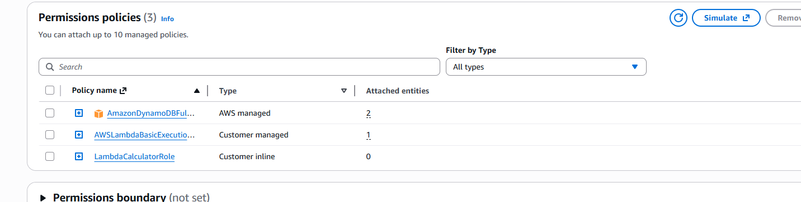
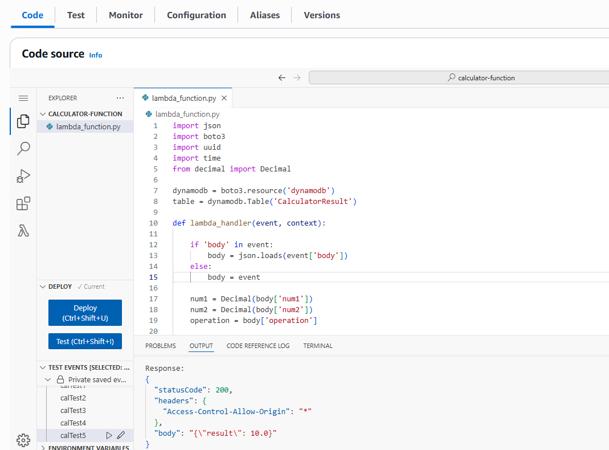
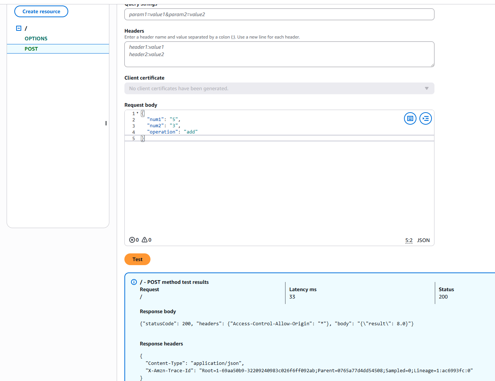
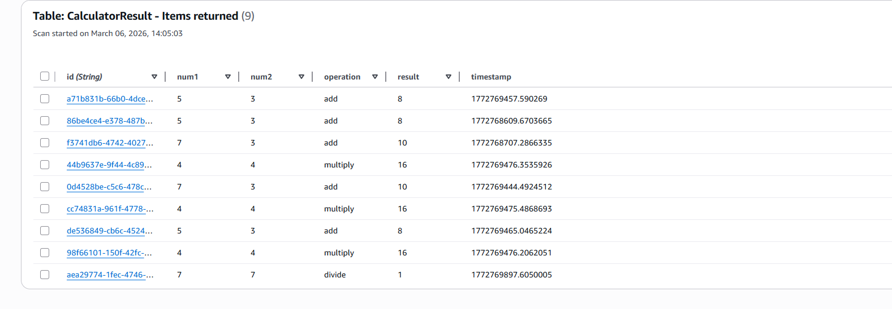

# AWS  Calculator

A simple **serverless calculator** web application using AWS services.  
The project demonstrates integration of a frontend with backend cloud services including **API Gateway, Lambda, DynamoDB, IAM, and Amplify**.

---

## Project Architecture

This project uses the following AWS services:

- **AWS Amplify** – deploy and host the frontend
- **Amazon API Gateway** – create REST API endpoints
- **AWS Lambda** – perform calculator operations
- **Amazon DynamoDB** – store calculation results
- **AWS IAM** – manage permissions and roles

### Architecture Diagram
Frontend (HTML/CSS) -->API Gateway-->Lambda Function-->DynamoDB Database

---

## Frontend

The frontend is a simple calculator built using:

- HTML
- CSS
- JavaScript (Fetch API)

It sends requests to the API Gateway endpoint.

**Example JSON request:**

```json
{
  "num1": "5",
  "num2": "3",
  "operation": "add"
}

```
## Lambda Function

The Lambda function performs the calculation and saves results to DynamoDB.
Supported operations:

- add
- subtract
- multiply
- divide

**Example Lambda response:**

```json
{
  "statusCode": 200,
  "body": "{\"result\": 8}"
}
```
## DynamoDB Table

**Table configuration:**

| Attribute	| Type |
| :-----------| :------|
|id|String|
|num1|Number|
|num2|Number|
|operation|String|
|result|Number|
|timestamp|String|

## Deployment Steps
1. Create DynamoDB Table

- Table name: CalculatorResult

- Partition key: id (String)

2. Create Lambda Function

- Runtime: Python

- Attach IAM role with permission: DynamoDB full access
3. Create API Gateway

- REST API with POST /calculate

- Integration: Lambda Function

- Deploy stage: dev

- Example endpoint:
  `
  https://xxxxx.execute-api.ap-southeast-2.amazonaws.com/prod/calculate
  `
4. Deploy Frontend

- Push frontend code to GitHub

- Deploy automatically

## Screenshots
IAM


Lambda Function


API Gateway


DynamoDB Table


